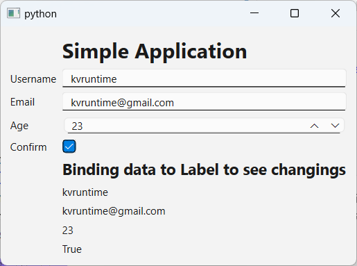

# QTMVVMTOOLKIT

## Overview

**QtMvvmToolkit** is a Python package designed to simplify the implementation of the Model-View-ViewModel (MVVM) architectural pattern in PyQt applications. This package provides a set of tools and abstractions to help you cleanly separate the concerns of your application, making it more modular, maintainable, and testable

## Features

- Seamless MVVM Integration: Easily integrate the MVVM pattern into your PyQt projects with minimal boilerplate code.

- Data Binding: Facilitate two-way data binding between your views and view models, keeping your UI in sync with underlying data.

- Command Handling: Simplify command execution and event handling in your view models.

- Declarative Syntax: Use a declarative approach to define bindings and commands, improving code readability and maintainability.

- Extensible: Easily extend or customize the package to fit your specific application needs.

## Installation

You can install QtMvvmToolkit using pip:

```bash
  pip install git+https://github.com/kvruntime/qtmvvmtoolkit.git@branch-or-tag-name
```

## Getting Started

### 1 Simple data binding

Import modules

```python
mport sys

from PyQt6.QtWidgets import *
from qtmvvmtoolkit.inputs import ObservableProperty
from qtmvvmtoolkit.objects import BindableObject
```

Create a Viewmodel

**ObservableProperty** are generic type that can be use to observe all basics type of data in python.

```python
class SimpleDataBindingViewModel:
    def __init__(self) -> None:
        self.username = ObservableProperty[str]("")
        self.email = ObservableProperty[str]("")
        self.age = ObservableProperty[int](0)
        self.confirm = ObservableProperty[bool](False)
        return
```

Create a views and inherit the **BindableObject** which contains all features that enable views to perform bindings.

```python
class SimpleDataBindingWidget(QWidget, BindableObject):
    def __init__(self, vm: SimpleDataBindingViewModel):
        super().__init__()
        self.vm = vm

        self.initialize_components()
        self.initialize_bindings()
        pass

    def initialize_components(self) -> None:
        layout = QFormLayout(self)
        layout.addWidget(QLabel("<h1>Simple Application</h1>"))

        self.lineedit_username = QLineEdit()
        self.lineedit_email = QLineEdit()
        self.spin_age = QSpinBox()
        self.check_confirm = QCheckBox()

        self.label_username = QLabel("-")
        self.label_email = QLabel("-")
        self.label_age = QLabel("-")
        self.label_confirm = QLabel("-")

        layout.addRow("Username", self.lineedit_username)
        layout.addRow("Email", self.lineedit_email)
        layout.addRow("Age", self.spin_age)
        layout.addRow("Confirm", self.check_confirm)
        #
        layout.addWidget(QLabel("<h2>Binding data to Label to see changings</h2>"))
        layout.addWidget(self.label_username)
        layout.addWidget(self.label_email)
        layout.addWidget(self.label_age)
        layout.addWidget(self.label_confirm)
        return
    
    # Here you call binding_value to bind widget->obserservable_property in the Viewmodel

    def initialize_bindings(self) -> None:
        self.binding_value(
            self.lineedit_username, self.vm.username, bindings="on-typing"
        )
        self.binding_value(self.lineedit_email, self.vm.email, bindings="on-typed")
        self.binding_value(self.spin_age, self.vm.age)
        self.binding_value(self.check_confirm, self.vm.confirm)
        #
        self.binding_value(self.label_username, self.vm.username)
        self.binding_value(self.label_email, self.vm.email)
        self.binding_value(self.label_age, self.vm.age)
        self.binding_value(self.label_confirm, self.vm.confirm)
        return

```

Run the app

```python
app = QApplication(sys.argv)
w = SimpleDataBindingWidget(SimpleDataBindingViewModel())
w.show()
w.setFocus()
app.exec()
```

Here you see realtime data binding & updating (all data typed in the entries are binded to observable properties which are binded to labels)



### 2 Use command & command with parameters

### 2 Use Messengers

## Documentation

For more detailed documentation and advanced usage, please refer to the documentation.

## Contributing

Contributions are welcome! Please refer to our contributing guidelines to get started.
License

This project is licensed under the MIT License.

## Contact

For questions or support, please reach out to <kvruntime@gmail.com>.
